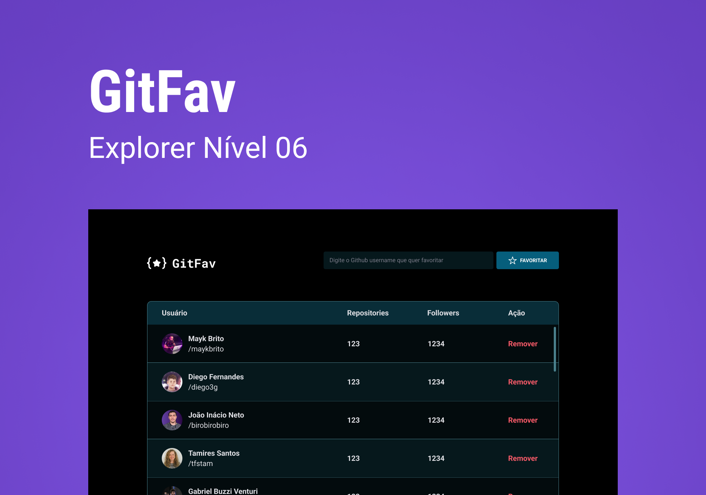

<h1 align='center'> :star: GitFav :star: </h1>

 Aplicação para favoritar usuários do Github utilizando uma API do Github 

  <a href="#-tecnologias">Tecnologias</a>&nbsp;&nbsp;&nbsp;|&nbsp;&nbsp;&nbsp;
  <a href="#-projeto">Projeto</a>&nbsp;&nbsp;&nbsp;|&nbsp;&nbsp;&nbsp;
  <a href="#-layout">Layout</a>&nbsp;&nbsp;&nbsp;|&nbsp;&nbsp;&nbsp;

  

  

## 🚀 Tecnologias

Esse projeto foi desenvolvido com as seguintes tecnologias:

- HTML e CSS
- JavaScript
- Git e Github
- Figma

## 💻 Projeto

* O GitFav é uma favoritador de usuários do Github, podendo ver o nome de usuário, total de seguidores e total de repositórios públicos. Essa aplicação utiliza da API do próprio Github.

* Com o desenvolvimento dessa aplicação eu aprendi: 
    * Conceitos de Orientação a Objetos no Javascript;
    * Como criar elementos HTML com a DOM;
    * Utilização do localStorage;
    * Conceitos de funções assíncronas, como o <strong>async</strong>, <strong>await</strong>, <strong>fetch</strong> e <strong>then</strong>;

## 🔖 Layout

Você pode visualizar o layout do projeto através [DESSE LINK](https://www.figma.com/file/JXQwoDz7sFnC4xw445Ssja/%5BDesafios-Explorer%5D-GitFav-(Copy)-(Copy)?type=design&node-id=301%3A324&mode=design&t=8OTNlpgMA0tiYqmP-1). É necessário ter conta no [Figma](https://figma.com) para acessá-lo.
    
